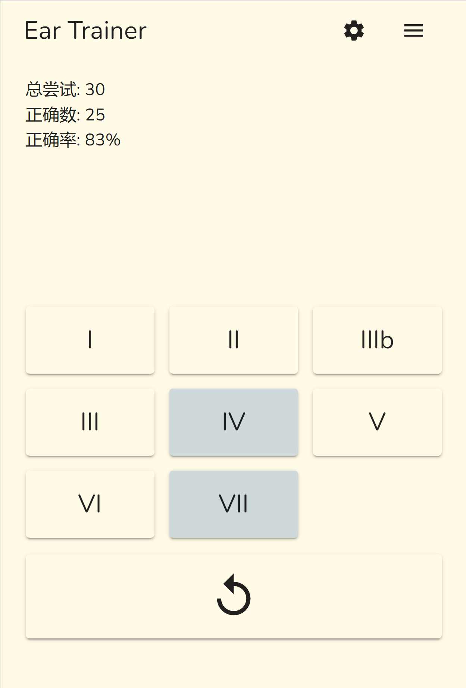
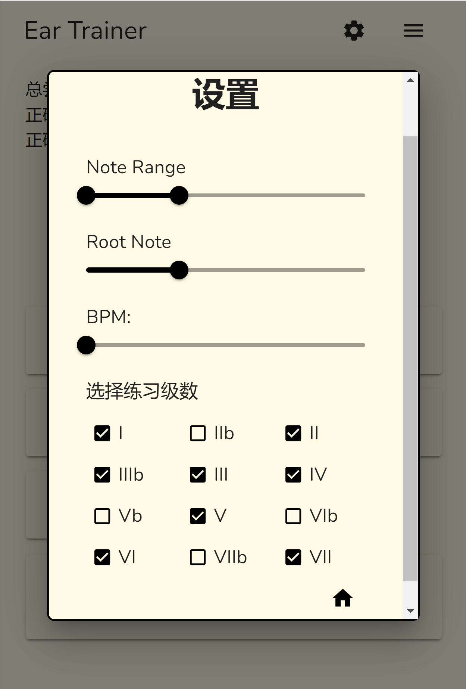
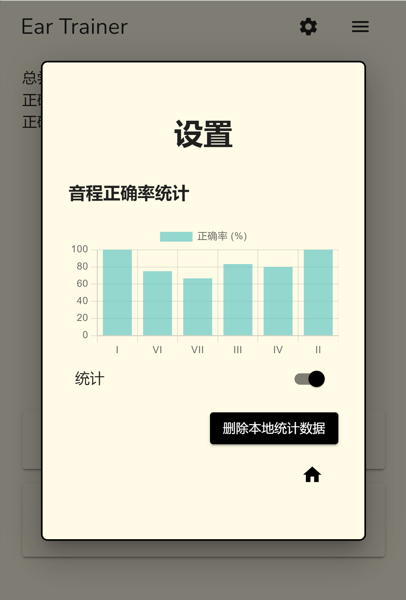
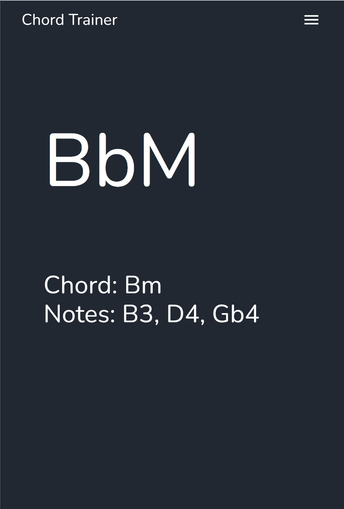

# [Music Refugee](https://musictrainer.barnman.cc)
[中文](README_zh.md) | English

This is a simple sight-singing and ear-training tool to help improve musical perception.

## Core Features
- [Ear Training](https://musictrainer.barnman.cc/ear-trainer)
   - Pitch Recognition: Practice recognizing pitches to improve musical hearing. I think intervals are useless.
   - Practice Statistics: Practice data is stored locally, allowing you to track your progress at any time.
   - Keyboard and MIDI Input Support: Practice using either a keyboard or MIDI device.
   - Handfree Mode: Practice without looking at the screen. Answer is given after a set time.
   - Instrument sounds: Choose any instruments you like.
- [Chord Training](https://musictrainer.barnman.cc/chord-trainer)
   - Chord Selection and Practice: Select a chord type and play it using a MIDI device. After correctly playing it, the next chord will be generated.
   - Random Chord Generation: Generate various chords for practice to improve playing speed.
## Website Features

## [Click here to visit the website](https://musictrainer.barnman.cc)

## Self-Hosting Instructions
1. Clone the repository: `git clone my repo`
2. Install Node.js v22 using nvm: `nvm install 22`
3. Switch to Node.js v22: `nvm use 22`
4. Install dependencies: `npm i`
5. Start the development server: `npm run dev`

Tested on: Node v22.7.0 (npm 10.8.2) `~/.local/share/nvm/v22.7.0/bin/node`

## Thanks

This project uses the following libraries:

### Music Related
*   [tonal](https://github.com/tonaljs/tonal)
*   [tone](https://tonejs.github.io/)
*   [pitchfinder](https://github.com/danigb/pitchfinder)
*   [tonejs-instruments](https://github.com/nbrosowsky/tonejs-instruments)

### UI Related
*   [@emotion/react](https://emotion.sh/docs/introduction)
*   [@emotion/styled](https://emotion.sh/docs/introduction)
*   [@fontsource/roboto](https://fonts.google.com/specimen/Roboto)
*   [@headlessui/react](https://headlessui.com/)
*   [@heroicons/react](https://heroicons.com/)
*   [@uidotdev/usehooks](https://usehooks-ts.com/)
*   [motion](https://motion.dev/)
*   [react](https://react.dev/)
*   [react-dom](https://react.dev/)
*   [react-hot-toast](https://react-hot-toast.com/)
*   [react-i18next](https://react.i18next.com/)
*   [react-router-dom](https://reactrouter.com/en/main)
*   [react-scripts](https://www.npmjs.com/package/react-scripts)
*   [uplot](https://github.com/leeoniya/uPlot)
*   [zustand](https://github.com/pmndrs/zustand)

### Performance Related
*   [i18next](https://www.i18next.com/)
*   [i18next-browser-languagedetector](https://github.com/i18next/i18next-browser-languagedetector)
*   [i18next-http-backend](https://github.com/i18next/i18next-http-backend)
*   [idb-keyval](https://github.com/jakearchibald/idb-keyval)
*   [lodash-es](https://lodash.com/)
*   [web-vitals](https://github.com/GoogleChrome/web-vitals)
